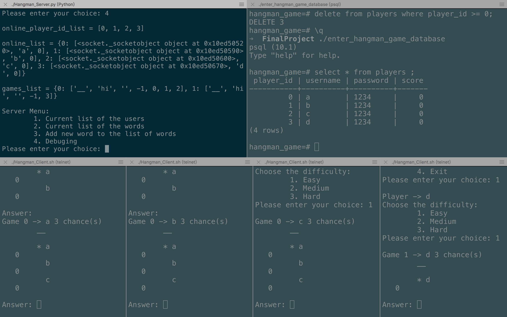

# Hangman Game - UCR 2017 Fall CS 164 Final Project

## By
Leng Zhang : [https://github.com/lengzhang](https://github.com/lengzhang 'Leng Zhang\'s GitHub')

## Introduction

In this project, my program emulates a network topology consisting of one server and multiple client nodes and implement a multi-player Hangman game application on top of this topology using a client-server model.

## Requirement

1. Telent - In this program, I use simple telent for clients.

2. PostgreSQL - This program needs a PostgreSQL database ```hangman_game``` to manage game data.

## Server-Side Interface

    Server Menu:
        1. Current list of the users
        2. Current list of the words
        3. Add new word to the list of words
        4. Debuging
    Please enter your choice:

#### 1. Current list of the users:
    Printing out all registered users' id, username, and user's highest score;

#### 2. Current list of the words
    Printing out current words that can be selected by server randomly as the word;

#### 3. Add new word to the list of words
    Adding new word to the word list in database;

#### 4. Debuging
This option is for debuging, it will print out arrays of online_player_id_list, online_list, and games_list;

* online_player_id_list - ```[player 1 id, player 2 id, ...]```
* online_list - `{player_id : [conn, user name, score], player_id : [conn, user name, score], ...}`
* games_list - `{game id : [Question, Answer, Incorrect, current player index, player 1 id, player 2 id, player 3 id], ...}`

### Client-Side Interface
```
Player Menu:
    1. Login
    2. Make New User
    3. Hall of Fame
    4. Exit
Please enter your choice:
```

#### 1. Login
* After selecting Login, server sends a message to client and ask user to type his username first and send it and type his password after it, if they are correct, user is logged in to the system. Otherwise, return to `Player Menu`.
    ```
    Player Menu -> Login
    Please enter your User Name:
    Please enter your Password:
    ```

#### 2. Make New User
* For sign up, if the Username is not already taken, this account is made and client returns to `Player Menu`.
    ```
    Player Menu -> Make New User
    Please enter your User Name:
    Please enter your Password:
    ```

#### 3. Hall of Fame
* Server sends list of the top scorers in the game, and return to `Player Menu`.

#### After user selecting option 1 to login:
    Player -> username
        1. Start New Game
        2. Get list of the Games
        3. Hall of Fame
        4. Exit
    Please enter your choice:

##### 1. Start New Game
* After selecting Start New Game, user gets to choose the difficulty level of the game via the following menus: 
    ```
    Player -> username
    Choose the difficulty:
        1. Easy
        2. Medium
        3. Hard
    Please enter your choice:
    ```
    > The user types the difficulty level, the the game starts. The difficulty level determines the number of rows of allowable wrong leter guesses for the word: `Easy - 3`, `Medium - 2`, `Hard - 1`.

    > Throughout the game, players can join and participate in the game. Each game has maximum 3 players. If the fourth selects option 1, he will be placed in a new game.

    > With every move a player makes, the result will appear on all participating players' screen. An example game information, for some instance of time during the game for the word "hangman", looks like the following:
    ```
    Game 0 -> leng 2 chance(s)
        h _ _ g _ _ _
        e i r b
        * Ali                      1
          Mohammad                 0
          Marcos                   0

    Answer:
    ```
    * h _ _ g _ _ _ : correctly guessed letters

    * e i r b : incorrectly guessed letters so far

    > The aboce also shows the list of players playing the game right now, together with their current scores and also indicating whose turn it is right now (marked by *).

    > Guessing each letter correctly adds 1 to the score of that player and the score for guessing the whole word correctly equals the length of the word (which is added to the winner's previous score from guessing individual letters; e.g. if Mohammad guesses the whold word correctly now, his score would be 1+7=8). Obviously, words only consist of lower case alphabets letters (no numbers or special characters).

    > The game is round-based and each person can guess one letter at his turn. If he guesses it correctly, he can guess another letter too. But on an incorrect guess the turn is given to the next player.

    > A player can guess the whole word any time during the game (even if it is not his turn). If his guess is incorrect, he has lost the game and is removed from the game. (No update will be sent to him and his client needs to show the previous menu for selecting another game or making a new game) If only only one character is typed, it is single letter guess but if it is more than one, it should be counted as whole word guess.

## Game Display
